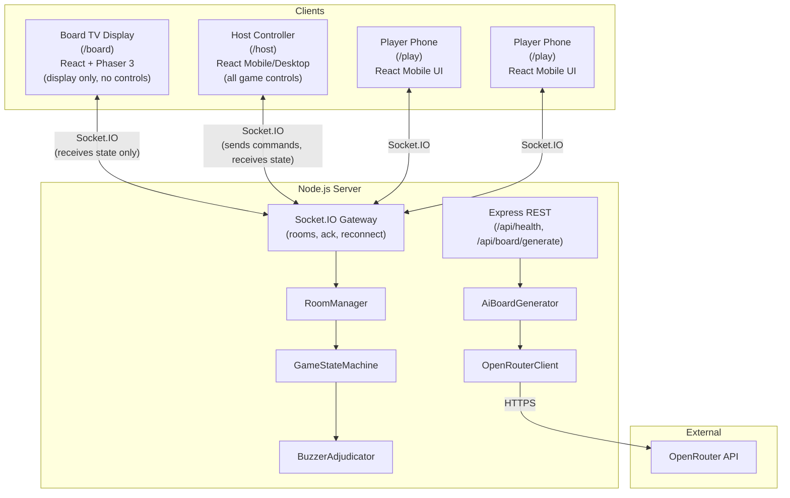
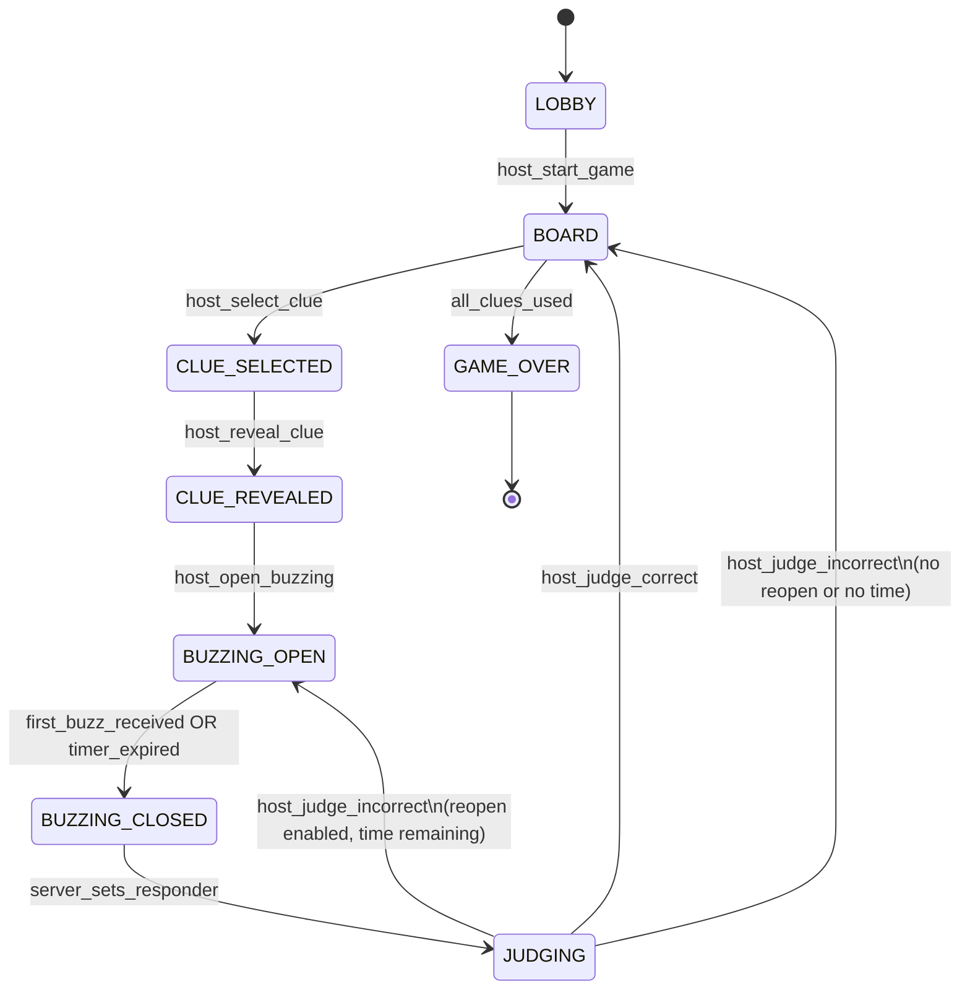

# AnswerArena -- Jeopardy! Clone Party Game

## 1. Architecture Overview




### Three-Client Architecture

There are **3 distinct routes**, each designed for a different screen:

- `**/board`** -- TV Display (read-only). Shown on the TV via laptop HDMI, Chromecast, or smart TV browser. Renders the Phaser 3 board, scores, room code. No interactive controls. When a clue is selected, the **entire screen transitions to a full-screen clue reveal** (classic Jeopardy: dark blue background, large white text, clue fills the viewport). Returns to the board grid after judging.
- `**/host`** -- Host Controller. Runs on the host's phone or a separate laptop tab. Contains all game controls: create room, manage lobby, select clues from a mini-board, reveal clue, open/close buzzing, see correct answer + explanation, mark correct/incorrect, skip clue, regenerate content. No Phaser -- just clean React UI with large tap targets.
- `**/play`** -- Player Controller. Runs on players' phones. Join with room code, see clue text, big BUZZ button, feedback.

The host opens `/board` on the TV and `/host` on their phone. Both join the same room (the host controller authenticates with the `hostPin` returned at room creation).

**Data flow**: All game state lives on the server. The host controller sends commands via Socket.IO; the server validates transitions via `GameStateMachine`, adjudicates buzzes via `BuzzerAdjudicator`, and broadcasts state updates to all three client types. The board TV is a passive receiver -- it never sends game commands, only listens. AI board generation is triggered by the host controller via REST (to avoid blocking the WebSocket pipeline) and loaded into the game state.

---

## 2. Key Technology Decisions


| Decision          | Choice              | Rationale                                                                                                                      |
| ----------------- | ------------------- | ------------------------------------------------------------------------------------------------------------------------------ |
| WebSocket library | **Socket.IO**       | Built-in rooms, acknowledgements, auto-reconnect with backoff, HTTP long-polling fallback -- critical for phones on flaky WiFi |
| Unit test runner  | **Vitest**          | Native Vite integration, ESM-first, faster than Jest, same API surface                                                         |
| E2E test runner   | **Playwright**      | Best headless support, multi-browser, built-in assertions, `page.waitForSelector` patterns                                     |
| Bundler           | **Vite**            | Fast HMR, native TS/React support, Phaser 3 compatible                                                                         |
| Monorepo tool     | **pnpm workspaces** | Phantom-dep prevention, workspace protocol, fast installs                                                                      |


---

## 3. Game State Machine




**State model** (in `packages/shared/src/types/gameState.ts`):

```typescript
type GamePhase =
  | 'LOBBY'
  | 'BOARD'
  | 'CLUE_SELECTED'
  | 'CLUE_REVEALED'
  | 'BUZZING_OPEN'
  | 'BUZZING_CLOSED'
  | 'JUDGING'
  | 'GAME_OVER';

interface RoomState {
  roomCode: string;
  hostId: string;
  hostPin: string;
  phase: GamePhase;
  players: Map<string, Player>;
  board: Board;             // 6 categories x 5 clues
  activeClue: ActiveClue | null;
  buzzerState: BuzzerState | null;
  settings: GameSettings;
}

interface Player {
  id: string;
  displayName: string;
  score: number;
  connected: boolean;
}

interface ActiveClue {
  categoryIndex: number;
  clueIndex: number;
  clue: ClueData;           // clue text only to players; full data to host
  timerStartedAt: number;
  timerDurationMs: number;
}

interface BuzzerState {
  isOpen: boolean;
  buzzOrder: BuzzAttempt[];  // server-timestamped
  winnerId: string | null;
  lockedOutIds: string[];    // players who answered incorrectly
}
```

---

## 4. WebSocket Event Contracts

### Client -> Server Events

```typescript
// Host controller events
'host:create_room'       -> { } => ack: { roomCode, hostPin }
'host:start_game'        -> { roomCode }
'host:select_clue'       -> { categoryIndex, clueIndex }
'host:reveal_clue'       -> { }
'host:open_buzzing'      -> { }
'host:judge'             -> { correct: boolean, reopenBuzzing?: boolean }
'host:skip_clue'         -> { }
'host:reclaim'           -> { roomCode, hostPin }

// Board TV events (minimal -- display only)
'board:join'             -> { roomCode } => ack: { state }

// Player events
'player:join'            -> { roomCode, displayName } => ack: { playerId, token }
'player:buzz'            -> { } => ack: { accepted, reason? }
'player:rejoin'          -> { roomCode, token } => ack: { state }
```

### Server -> Client Events

```typescript
'room:state_update'      -> { phase, players, scores, board }
'room:player_joined'     -> { player }
'room:player_left'       -> { playerId }
'clue:selected'          -> { categoryIndex, clueIndex }
'clue:revealed'          -> { clueText, value, timerDurationMs }
'clue:full_data'         -> { ...clueText, answer, acceptable, explanation }  // host only
'buzzer:opened'          -> { timerRemainingMs }
'buzzer:attempt'         -> { playerId, accepted, reason? }
'buzzer:winner'          -> { playerId, displayName }
'buzzer:closed'          -> { reason: 'won' | 'timeout' }
'judge:result'           -> { correct, playerId, scoreChange, newScore }
'game:over'              -> { finalScores }
'error'                  -> { code, message }
```

### Ack/Error Pattern

Every client event uses Socket.IO acknowledgements:

```typescript
socket.emit('player:buzz', {}, (response: { accepted: boolean; reason?: string }) => {
  // handle locally
});
```

Server errors use a typed error event: `{ code: string, message: string }`.

---

## 5. Storage Plan

**MVP**: In-memory `Map<string, RoomState>` inside `RoomManager`. Rooms auto-expire after 2 hours of inactivity.

**Future persistence path**: Serialize `RoomState` to Redis (JSON) for horizontal scaling. Add PostgreSQL for game history, leaderboards, and custom category libraries. The `RoomManager` interface stays the same -- swap the backing store behind it.

---

## 6. Monorepo Folder Structure

```
AnswerArena/
  pnpm-workspace.yaml
  package.json              (root: scripts, devDeps for tooling)
  tsconfig.base.json
  .env.example
  .github/
    workflows/
      ci.yml
  apps/
    client/                 (React + Vite + Phaser)
      package.json
      tsconfig.json
      vite.config.ts
      index.html
      src/
        main.tsx
        App.tsx
        hooks/
          useSocket.ts
          useGameState.ts
        pages/
          BoardPage.tsx     (/board route -- TV display, Phaser, read-only)
          HostPage.tsx      (/host route -- host controller, no Phaser)
          PlayPage.tsx      (/play route -- player controller)
        components/
          board/
            BoardPhaser.tsx         (Phaser container for TV display)
            ScoreBar.tsx            (player scores shown on TV)
            RoomCodeOverlay.tsx     (big room code on TV)
          host/
            CreateRoom.tsx
            HostLobby.tsx
            MiniBoard.tsx           (small board for clue selection)
            JudgePanel.tsx          (correct answer + judge buttons)
            ClueControls.tsx        (reveal, open buzz, skip)
            CategoryManager.tsx     (regenerate, custom categories)
          player/
            JoinForm.tsx
            WaitingRoom.tsx
            BuzzButton.tsx
            PlayerStatus.tsx
        phaser/
          scenes/
            BoardScene.ts          (6x5 grid + full-screen clue reveal)
          config.ts
        styles/
          global.css
    server/
      package.json
      tsconfig.json
      src/
        index.ts
        app.ts              (Express + Socket.IO setup)
        modules/
          RoomManager.ts
          GameStateMachine.ts
          BuzzerAdjudicator.ts
        ai/
          OpenRouterClient.ts
          AiBoardGenerator.ts
          prompts.ts
          sampleBoard.ts    (fallback)
          schema.ts         (Zod validation)
        config.ts           (env)
  packages/
    shared/
      package.json
      tsconfig.json
      src/
        types/
          events.ts
          gameState.ts
          board.ts
          ai.ts
        constants.ts
        index.ts
  tests/
    unit/
      GameStateMachine.test.ts
      BuzzerAdjudicator.test.ts
      Scoring.test.ts
      AiBoardValidation.test.ts
      RoomManager.test.ts
    e2e/
      gameplay.spec.ts
      reconnect.spec.ts
      playwright.config.ts
```

---

## 7. Scaffolding -- Key Files

### Root config

- `pnpm-workspace.yaml`: declares `apps/*` and `packages/*`
- Root `package.json`: workspace scripts (`dev`, `build`, `test`, `test:e2e`, `test:all`), shared devDeps (TypeScript, ESLint, Prettier)
- `tsconfig.base.json`: strict mode, ESM, path aliases for `@shared/*`
- `.env.example`: `OPENROUTER_API_KEY`, `OPENROUTER_MODEL=google/gemini-2.0-flash-001`, `PORT=3001`, `CLIENT_URL=http://localhost:5173`

### Server (`apps/server`)

- `**src/app.ts**`: Express + CORS + Socket.IO server. Socket.IO configured with `cors`, `pingInterval: 10000`, `pingTimeout: 5000`. Registers namespace `/` with event handlers that delegate to `RoomManager`.
- `**src/modules/RoomManager.ts**`: `Map<string, RoomState>`. Methods: `createRoom()`, `joinRoom()`, `getRoom()`, `removePlayer()`, `reclaimHost()`. Generates 5-char alphanumeric room codes. Stores `hostPin` (6-digit) for reclaim.
- `**src/modules/GameStateMachine.ts**`: Pure function `transition(state: RoomState, action: GameAction): RoomState | Error`. Validates phase transitions per the state diagram. Returns new state or throws `InvalidTransitionError`.
- `**src/modules/BuzzerAdjudicator.ts**`: `receiveBuzz(roomState, playerId, serverTimestamp)` -> `{ accepted, reason?, winnerId? }`. Checks: buzzing open, player not locked out, not already won. First buzz by `serverTimestamp` wins. On reopen, resets `winnerId` but keeps `lockedOutIds`.
- `**src/ai/OpenRouterClient.ts**`: `generate(systemPrompt, userPrompt, opts)` with retries (3 attempts, exponential backoff 1s/2s/4s), 429/5xx retry, timeout 30s. Uses `fetch` to `https://openrouter.ai/api/v1/chat/completions`.
- `**src/ai/AiBoardGenerator.ts**`: Calls `OpenRouterClient`, parses JSON, validates with Zod schema (`schema.ts`). On failure, retries once, then falls back to `sampleBoard.ts`.
- `**src/ai/schema.ts**`: Zod schema enforcing 6 categories, 5 clues each, values exactly [200,400,600,800,1000], string constraints.

### Client (`apps/client`) -- 3 Routes

- `**src/App.tsx**`: React Router with 3 routes: `/board`, `/host`, `/play`. No auth required.
- `**src/hooks/useSocket.ts**`: Creates and manages Socket.IO connection. Provides `emit` with typed ack, `on`/`off` for events. Auto-reconnect enabled. Accepts a `role` param (`'board' | 'host' | 'player'`) so the server knows what state to send.
- `**src/hooks/useGameState.ts**`: Listens to `room:state_update` and maintains local state via `useReducer`.

#### `/board` -- TV Display (read-only)

- `**src/pages/BoardPage.tsx**`: Fullscreen Phaser board. Before game starts: shows room code (72px+) and player join list. During game: renders the 6x5 board grid. On clue select/reveal: **classic Jeopardy full-screen takeover** -- the entire viewport becomes a dark blue screen with the clue text in large white centered text. Returns to board after judging. Shows score bar at bottom. No interactive controls -- purely display.
- `**src/components/board/BoardPhaser.tsx`**: `useEffect` to init Phaser game. `BoardScene` receives state updates via Phaser event emitter. Cleanup on unmount.
- `**src/phaser/scenes/BoardScene.ts`**: Renders 6x5 grid (category headers in top row, value cells below). Used clues dim/grey out. **Full-screen clue reveal**: when a clue is revealed, the board cross-fades to a full-viewport blue screen with the clue text in large centered white font (min 48px). After judging, cross-fades back to the grid. High-contrast TV-friendly: Jeopardy blue (#060CE9) background, gold ($FFD700) values, white text.

#### `/host` -- Host Controller (all controls, no Phaser)

- `**src/pages/HostPage.tsx`**: Phases:
  1. **Create room**: one button, receives `roomCode` + `hostPin`. Instructions: "Open `/board?room=XXXXX` on your TV."
  2. **Lobby**: shows connected players, "Start Game" button, AI board generation controls (pick categories, difficulty, generate/regenerate).
  3. **In-game controller**: mini-board grid (compact, tappable) for clue selection. Once a clue is selected, shows: clue text, correct answer, acceptable variants, explanation. Buttons: "Reveal to TV", "Open Buzzing", then after buzz: responder name + "Correct" / "Incorrect" (with optional reopen toggle). After judging: returns to mini-board.
- `**src/components/host/MiniBoard.tsx`**: Compact 6x5 grid showing category abbreviations + values. Tappable cells. Used clues crossed out.
- `**src/components/host/JudgePanel.tsx`**: Shows buzzer winner name, correct answer, explanation. Large "Correct" (green) and "Incorrect" (red) buttons. Toggle for "Reopen buzzing on incorrect".

#### `/play` -- Player Controller (mobile-first)

- `**src/pages/PlayPage.tsx`**: Mobile-first. (1) Join form with large inputs, (2) Waiting room, (3) Clue view + BUZZ button (fills ~60% of viewport, min 120px tall), (4) Result feedback with haptic.
- `**src/components/player/BuzzButton.tsx`**: Massive button, `min-height: 120px`, `border-radius: 16px`, red when active, grey when locked. Calls `navigator.vibrate(100)` on buzz. Disabled states: "Waiting...", "Too late!", "You're up!".

### Shared (`packages/shared`)

- All TypeScript types/interfaces for events, game state, board data, AI schema.
- Constants: `CLUE_VALUES = [200, 400, 600, 800, 1000]`, `CATEGORIES_COUNT = 6`, `CLUES_PER_CATEGORY = 5`, `DEFAULT_TIMER_MS = 12000`.
- Exported as `@answer-arena/shared` via workspace protocol.

---

## 8. Testing

### Unit Tests (Vitest)

All in `tests/unit/`. Run via `pnpm test`.

- `**GameStateMachine.test.ts`**: Test every valid transition in sequence (LOBBY -> BOARD -> ... -> GAME_OVER). Test that invalid transitions throw (e.g., LOBBY -> JUDGING). Test edge cases (all clues used triggers GAME_OVER).
- `**BuzzerAdjudicator.test.ts`**: First buzz wins. Second buzz rejected with `reason: 'already_won'`. Buzz when closed rejected with `reason: 'closed'`. Locked-out player rejected with `reason: 'locked'`. Reopen clears winner but keeps lockouts.
- `**Scoring.test.ts`**: Correct answer adds value. Incorrect subtracts value (when penalty enabled). Incorrect with penalty disabled: no change. Cumulative scoring across multiple clues.
- `**AiBoardValidation.test.ts`**: Valid payload passes. Missing category rejects. Wrong clue count rejects. Duplicate values rejects. Non-JSON string rejects. Missing fields reject.
- `**RoomManager.test.ts`**: Create room returns code + pin. Join room adds player. Duplicate display name handled. Rejoin with token restores player. Host reclaim with correct pin succeeds; wrong pin fails.

### E2E Tests (Playwright)

All in `tests/e2e/`. Run via `pnpm test:e2e`.

- `**gameplay.spec.ts`**: Full gameplay loop -- create room, 2 players join, start game, select clue, reveal, buzz, judge correct, verify score, judge incorrect + rebuzz flow. Uses Playwright's `page.waitForSelector` and Socket.IO client in test helpers.
- `**reconnect.spec.ts`**: Player disconnects (page reload), reconnects with same token, verifies state restored.

### CI (GitHub Actions)

- `.github/workflows/ci.yml`: Checkout, pnpm install, `pnpm test` (unit), build client+server, start server in background, `pnpm test:e2e` (headless Chromium), upload test artifacts.

---

## 9. OpenRouter Integration Detail

**System prompt** (in `apps/server/src/ai/prompts.ts`):

```
You are a trivia question generator for a Jeopardy!-style game.
Return ONLY valid JSON matching the schema below. No markdown, no commentary.
Rules:
- Exactly 6 categories, exactly 5 clues per category
- Values must be exactly: 200, 400, 600, 800, 1000 (one each, increasing difficulty)
- Content must be family-friendly
- No hateful, sexual, or discriminatory content
- No long quotes from copyrighted sources
- Clues should be phrased as statements (Jeopardy-style "answers")
- Answers should be phrased as questions ("What is...?")
[JSON SCHEMA HERE]
```

**Request structure**:

```typescript
{
  model: process.env.OPENROUTER_MODEL,
  messages: [
    { role: 'system', content: systemPrompt },
    { role: 'user', content: `Generate a ${difficulty} board with categories: ${categories.join(', ')}` }
  ],
  response_format: { type: 'json_object' },
  temperature: 0.8,
  max_tokens: 4000
}
```

Headers: `Authorization: Bearer ${OPENROUTER_API_KEY}`, `Content-Type: application/json`, `HTTP-Referer: ${CLIENT_URL}`.

---

## 10. Dev Experience

- `pnpm install` at root installs everything
- `pnpm dev` runs both client (Vite on :5173) and server (tsx watch on :3001) concurrently
- `pnpm build` builds client (Vite) and server (tsc)
- `pnpm test` runs Vitest unit tests
- `pnpm test:e2e` builds, starts server, runs Playwright
- `pnpm test:all` runs unit + E2E sequentially

